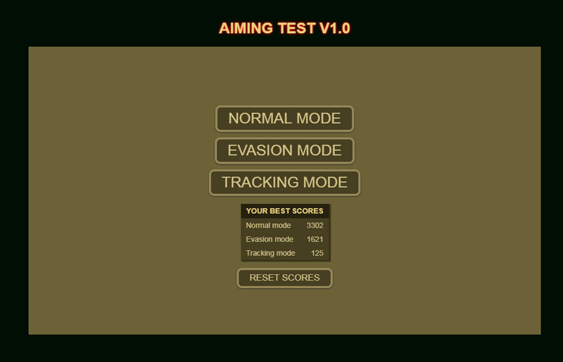

# Aiming Test
**Aiming Test** is a small challenge that tests our dexterity with the mouse.
Speed and precision are essential to get a good score.

[Play the game here](https://jjcapellan.github.io/aimingtest/)

## How to play
Move the pointer with the mouse and press left button to shoot the targets.

## Play modes
### Normal mode
You have to shoot ten static targets.
The distance to the target center, and the shot time determine our score.
#### Bonus:
- Distance to target center < 5px : +400 points
- Shot time < 400ms : +1000 points
#### Penalties:
- Failed shot : -400 points
### Evasion mode
In this mode the targets the objectives move according to your movements with the mouse. the score system is the same as in Normal mode.
### Tracking mode
Here is a single objective that is in permanent motion. We must place the pointer on the objective and keep the button pressed to make points. This test ends in 60 seconds.
#### Score
- Each second hiting target : +10 points
- Each second failing the target : -10 points
- Each second of idle time: -0.5 points

## Screenshots

## Used tools
This game was developed using **Visual Studio Code**, **Mongoose** as server and **Chrome** for debugging the code.
Languages: html5, css and javascript.
Frameworks: [Phaser CE](https://github.com/photonstorm/phaser-ce)

